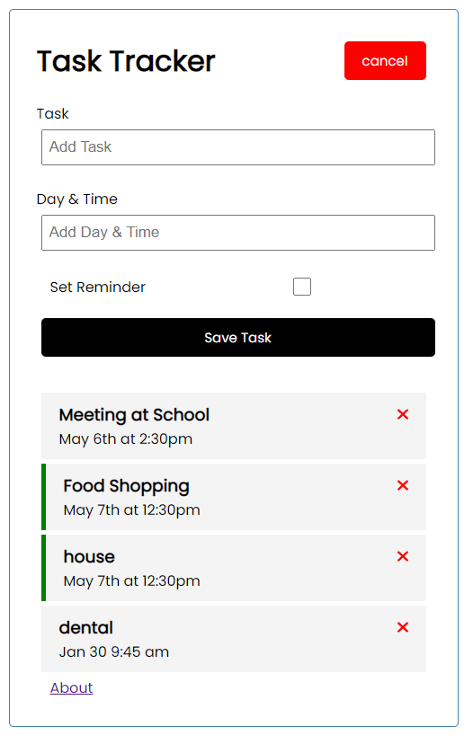
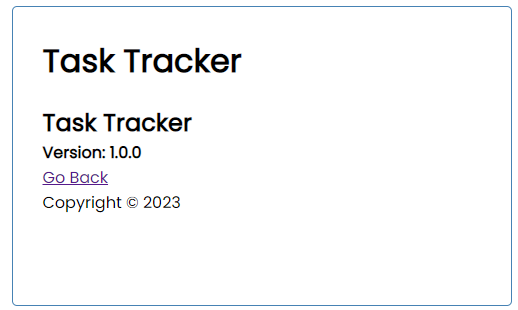

# Task Tracker App
**This is a demo project for quickly pick up Angular.** 

### How to start the project: 
<code>ng serve</code> \
**port: 4200** 

**Server is based on [Json server](https://www.npmjs.com/package/json-server) to provide mock API interactions and DB operations.**  \
**port: 5000** 
### How to start mock server:
<code>npm run server</code> 

### Functions
1. Click the add button will pop up a form for adding a task
2. Can set reminder by double clicking a task
3. Can delete a task

### API 
Get all tasks: \
**[Get]** <code>http://localhost:5000/tasks</code> \
Delete a task: \
**[Delete]** <code>http://localhost:5000/tasks/<task_id></code> \
Update a task reminder: \
**[Put]** <code>http://localhost:5000/tasks/<task_id></code> \
Add a task: \
**[Post]** <code>http://localhost:5000/tasks</code> 

